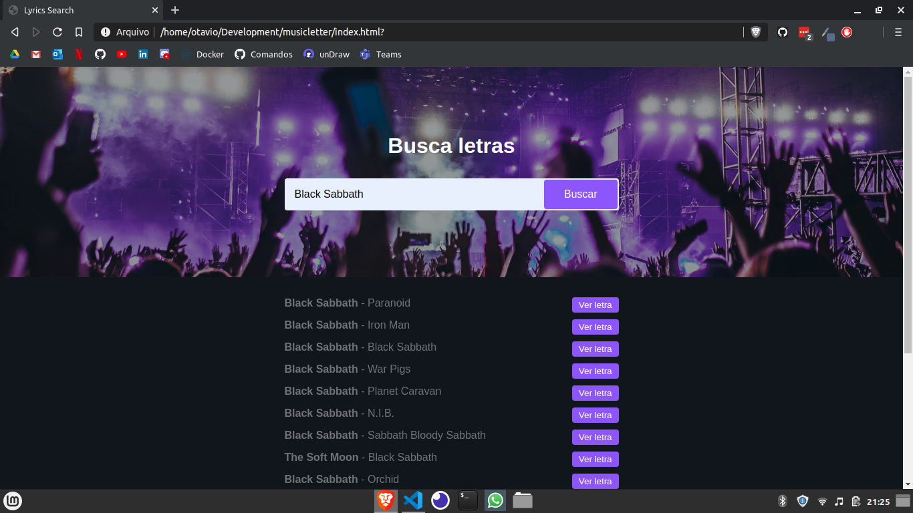
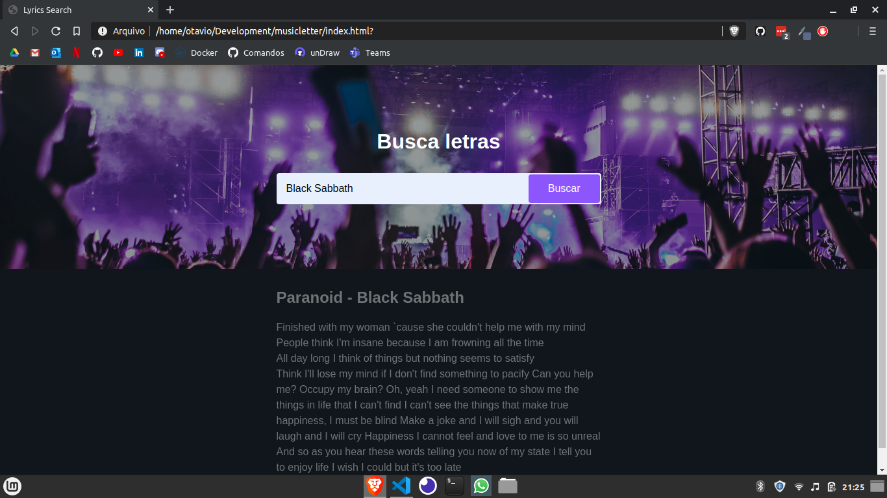

# Pesquisa de letra da música
Aplicação que busca todas as músicas dos artista pesquisado e quando selecionada mostra a sua respectiva letra, desenvolvido com JavaScript puro consumindo a API [lyrics.ovh](https://lyricsovh.docs.apiary.io/#)

  
  

  
  

